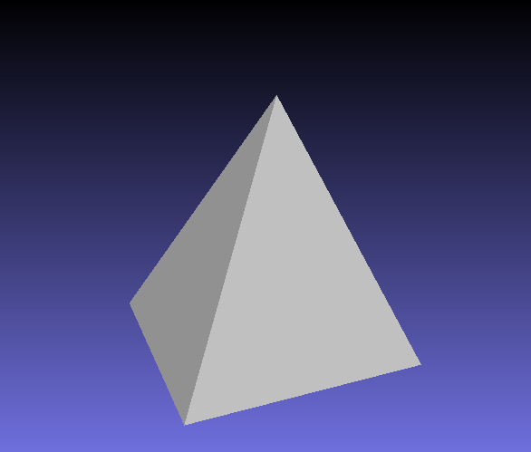

## Mesh (final submission)

Please fill this out and submit your work to Gradescope by the deadline.

### Output Comparison
Run the program with the specified `.ini` config file to compare your output against the reference images. The program should automatically save the output mesh to the `student_outputs/final` folder. Please take a screenshot of the output mesh and place the image in the table below. Do so by placing the screenshot `.png` in the `student_outputs/final` folder and inserting the path in the table.

- For instance, after running the program with the `subdivide_icosahedron_4.ini` config file, go to and open `student_outputs/final/subdivide_icosahedron_4.obj`. Take a screenshot of the mesh and place the screenshot in the first row of the first table in the column titled `Your Output`.
- The markdown for the row should look something like `| subdivide_icosahedron_4.ini |   |  |`

If you are not using the Qt framework, you may also produce your outputs otherwise so long as the output images show up in the table. In this case, please also describe how your code can be run to reproduce your outputs.

> Qt Creator users: If your program can't find certain files or you aren't seeing your output images appear, make sure to: 
> 1. Set your working directory to the project directory
> 2. Set the command-line argument in Qt Creator to `template_inis/final/<ini_file_name>.ini`

Note that your outputs do **not** need to exactly match the reference outputs. There are several factors that may result in minor differences, especially for certain methods like simplification where equal-cost edges may be handled differently.

Please do not attempt to duplicate the given reference images; we have tools to detect this.

| `.ini` File To Produce Output | Expected Output | Your Output |
| :---------------------------------------: | :--------------------------------------------------: | :-------------------------------------------------: | 
| subdivide_icosahedron_4.ini |   |  |
| simplify_sphere_full.ini |   |  |
| simplify_cow.ini |  |  |

Output for Isotropic Remeshing (Note: if you did not implement this you can just skip this part)
| `.ini` File To Produce Output | Input Mesh .png | Remeshed Mesh .png |
| :---------------------------------------: | :--------------------------------------------------: | :-------------------------------------------------: | 
| <Path to your .ini file> |   |  |

Output for Bilateral Mesh Denoising (Note: if you did not implement this you can just skip this part)
| `.ini` File To Produce Output | Noisy Mesh .png | Denoised Mesh .png |
| :---------------------------------------: | :--------------------------------------------------: | :-------------------------------------------------: | 
| <Path to your .ini file> |   |  |

Output for any other Geometry Processing Functions (Note: if you did not implement this you can just skip this part)
| `.ini` File To Produce Output | Input | Output |
| :---------------------------------------: | :--------------------------------------------------: | :-------------------------------------------------: | 
| <Path to your .ini file> |   |  |

### Design Choices

#### Mesh Data Structure 
I implemented the halfedge mesh data structure. For each halfedge, there is a field 'twin' pointing to the twin of the current halfedge, a field 'next' pointing
to the next halfedge it connects to in the mesh, a field 'origin' pointing to its vertex, and a 'face' pointing to the halfedge's face. For a Vertex struct, its field contains its index as an int (used to constructing face), an arbitrary halfedge it points to, and its position as a vector. For a Face, its field only contains the halfedge it points to, which is also an arbitrary one. In my header file, I also keep a vector of vertices, a vector of faces and a vector of halfedges to store corresponding information for my mesh. These will be updated during mesh operations and will be used when writing the output file. In addition, I have a map 'vertexHalfedgeCount' which stores the number of neighbors (or the number of halfedges having it as vertex) of each vertex. 

#### Mesh Validator
Describe what your mesh validator checks for here. This can be a list.
My validator contains 19 assert statements that check on the above logic. 
To start, I check that size of halfedges should be 3 times size of faces (since each face correspond to 3 halfedges).
Second, I make sure for all halfedges, vertices and faces, every field should not be a nullptr, since we 
assume we are working on a closed geometry, and no operations should cause non-manifold. 
Third, I check that each halfedge is twin with its twin, that is, they are twins to each other. Also, 
the origin of each halfedge's twin should be the origin of its next halfedge. 
Fourth, I check that starting any halfedge and traverse through "next", it should perform a closed loop.
Fifth, I make sure that starting from any vertex and traverse the halfedges, there is also a closed loop.
Last, I make sure that any two halfedges cannot point to the same face; each face's halfedge should also point back to the face; and there exist no zero area faces, in other words, the vertices of each face should be unique. 

#### Run Time/Efficency 
Describe how you achieved efficient asymptotic running times for your geometry processing functions, including the data structures you used.
All three of my atomic operations runs constant time. In achieving this, I avoided looping through all of my vertices/halfedges/faces, instead, I also do local updates which includes removing/updating only the related halfedges/vertices/faces. 
My subdivison method runs 0.8 seconds on the icosahedron, with 5 iterations. I operate on halfedges, so first, I would pick the halfedges among all halfedges that can be split. Then, before spltting, I calculate the new positions of the old vertices as well as new positions and store them in two maps, respectively. Then I update the positions of the old vertices. Next I poceed to split the edges, and update positions of the new vertices. Lasty, I flip the edges that meets the condition.
My simplify method runs 0.03 seconds on the cow and 10 seconds on the peter.obj. I calculate the Q of faces and vertices, then the edge queue prior to the while loop. Inside the while loop, I remove the halfedges that will be deleted from collapse from the edge queue, and after collapse, update the error of the halfedges that are affected by collapse. 
My remesh method runs 20 seconds on the peter.obj. After calculating the average length, I split the edges longer than 4/3 average length, then collpase the edges shorter than 0.8 average length. Then, operating on the remaining halfedges, I flip edges that would reduce deviation from degree 6. Lastly, I update all the vertices to new positions using tagent difference. 
My denoise method runs 3.7 seconds on the bunny obj. I have two iterations over all vertices, the first is to get their vertex normals, and the second is to calculate the amount shift and update the vertex position. 

### Collaboration/References
N/A

### Known Bugs
N/A
